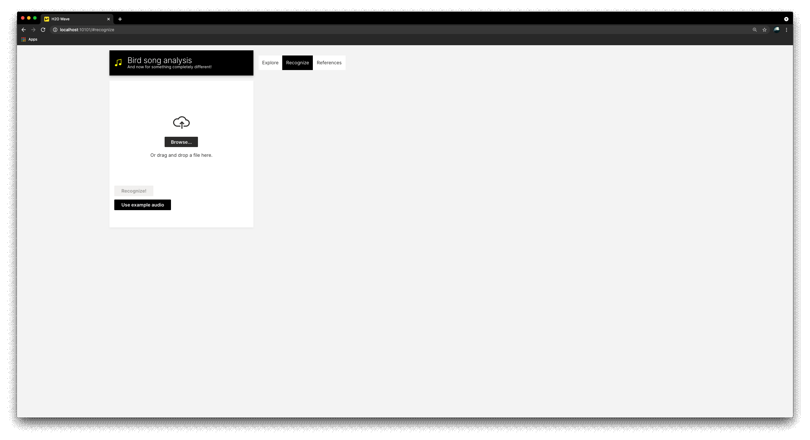

# Setup
Clone the repo and create python environment with the required dependencies.
```
python -m venv venv
source venv/bin/activate
python -m pip install --upgrade pip
pip install -r requirements.txt
# You might need ffmpeg/libsndfile or other system dependencies to get librosa working
```
Download & extract [Wave](https://github.com/h2oai/wave/releases/tag/v0.16.0)


## Run the app
1. Start the Wave development server: `$ ./waved`
2. Start the app: `$ wave run birds.run`
3. Go to http://localhost:10101/

# Explore
Simple dashboard inspired by ebird.org


# Recognize
Upload your own bird recording and analyze it with a single pretrained CNN14 model.

